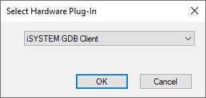
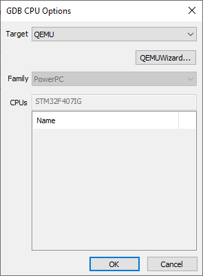
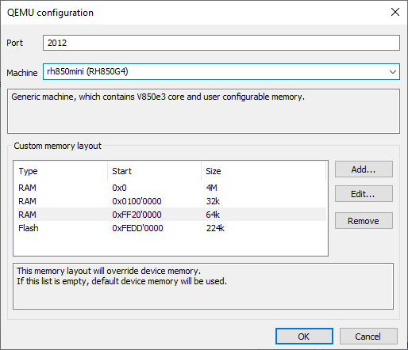
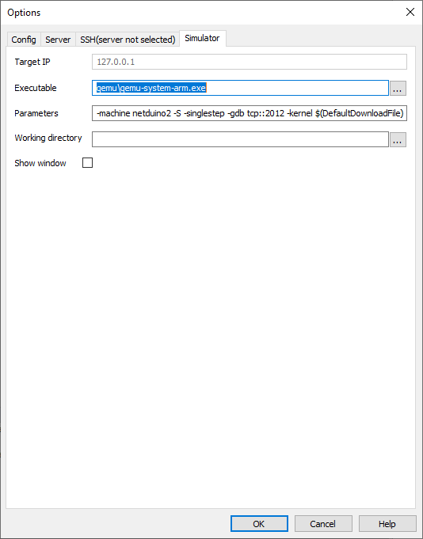

# Using QEMU with iSYSTEM tools

Overview
--------

[QEMU](https://www.qemu.org/) is a generic and open source machine emulator and
virtualizer. iSYSTEM tools can connect to QEMU device via GDB interface.  This
way winIDEA can be used to debug software, and testIDEA to execute unit tests.
While QEMU is not full replacement for real hardware, it can be used for
development and testing of code, which is not hardware dependent (functions
dealing with hardware can be stubbed with iSYSTEM test framework). This means that with
proper application design almost all code is testable with iSYSTEM tools and QEMU.

The main advantage of this approach is speed, because communication with QEMU
is much faster than with real device. Unit tests executed with testIDEA or
Python scripts can execute more than 100 times faster. By using stubbing
functionality of isystem.test you can make tests predictable and hardware
independent, which means they can be easily used in continuous integration
environments.

Since QEMU can be used also for development, less hardware is required 
for development team, which is an additional advantage.

iSYSTEM distribution of QEMU
--------

Since version 9.17.148, winIDEA comes with QEMU inclulded in the distribution,
so you do not have to install it yourself. Version of QEMU distributed with
iSYSTEM tools is based on open source [QEMU](https://www.qemu.org/), and supports:

- devices based on ARM cores (arm-softmmu, aarch64-softmmu). These devices
  are the same available in the official QEMU release. 
- V850E4 core (Renesas RH850 family). These devices are implemented by 
  iSYSTEM, and contain only core and memory, no peripherals are emulated. 

### Features added by iSYSTEM

Flash, RAM, and flash alias addresses and sizes for some machines are
configurable in command line.

- Flash option: `-flash start0=<flash start addr>,size0=<flash size>,...start5=<flash address>,size5=<flash size>`
- RAM option: `-ram start0=<RAM start addr>,size0=<RAM size>,...start5=<RAM start addr>,size5=<RAM size>`, 
    
Example:    

    -flash start0=0,size0=1M,start1=8M -ram start0=0xfebc0000,size0=256k

Currently you can use this feature on machines `netduino2` and `RH850`.
See description of these two devices in _QEMU Configuration wizard_ in winIDEA
for more information.

If you'd like to use distribution of QEMU from other vendor, you can still
configure winIDEA to use it. See section _Manual configuration of QEMU
invocation parameters_ below for more information on this topic.

winIDEA Configuration
--------

To use QEMU, only winIDEA has to be configured. testIDEA uses 
device agnostic interface called _isystem.connect_ to connect to winIDEA. It
doesn't care if tests are run in emulator or on physical hardware.

Good starting point for winIDEA configuration is workspace, which is already
configured for your physical target, but this is not required. Description 
below covers also this case.

### 1. Make sure your winIDEA workspace is configured as Multi-Application workspace

   In winIDEA open menu `File`. If option 
   `Convert Workspace to Multi-Application...` is present, then click it to
   make conversion. If the option is not present, you already have workspace 
   configured as _Multi-Application_ workspace.

### 2. Configure winIDEA to use GDB

   Select `Tools | isystem.open Plug-in ...`,
   then select `iSYSTEM GDB Client` plugin.
   

### 3. Configure QEMU invocation in winIDEA using wizard

   Select `Debug | Configure Session ...`, to open `System Configuration`
   dialog. If there are no Applications listed, add one by clicking button
   `Add...`, and entering application name and selecting architecture.  Then
   select tab `SoCs`. If there are no devices listed in the table, click button
   `Add ...`, otherwise click button `Edit...`. The dialog `SoC MCU` opens.
   Click button `Configure` to open dialog `GDB CPU Options`.  Select `QEMU` as
   `Target`.

    

   Click button `QEMU Wizard...` to open `QEMU configuration` dialog. Select 
   your device in the `Machine` combo-box. 
   
   Each entry in the comb-box specifies QEMU machine name, and matching
   iSYSTEM device name in parentheses, for example:

       netduino2 (STM32F205RF)

   This means that QEMU will be started with argument `-machine netduino2`, while
   winIDEA will show disassembly, core registers and SFRs of STM32F205RF. Note
   that QEMU devices do not necessarily support all peripherals, so not all
   SFRs shown in winIDEA will have meaningful values. Consult QEMU documentation
   for details on implementation of devices.

   

   __Note:__ Some machines specify core name as iSYSTEM device, for example:

       raspi2 (__Cortex-A53__)

   In such cases winIDEA will properly show disassembly and core registers, but
   it does not know details about specific SoC, so SFRs are not available.

   If QEMU device supports custom configuration of memory layout, default
   values are listed in `Custom memory layout` table as editable items. Edit them 
   to match your device. Currently memory layout customization is available
   only for `netduino2` and generic RH850 device.

   This approach enables you to use QEMU even if your device is not directly
   supported: select device with the same core, and specify memory layout. The
   code, which does not depend on peripheral devices, should work.

   Click `OK` to close the `QEMU Configuration` dialog, then click `OK` in
   `GDB CPU Options` dialog to get back to `SoC MCU` dialog.
   If you have started with winIDEA workspace, which was already configured 
   for pyhysical device, then close all dialogs, save workspace, and start
   session by selecting `Debug | Download`. Otherwise continue to the next step.
   
### 4. Configure program and symbol files

   Select tab `Program Files` in `SoC MCU` dialog and add your elf file there.
   Then click `OK` to get back to `System Configuration` dialog, select tab `Applications`,
   click `Edit` button, select tab `Symbol Files` and add
   file with symbol information there. Usually it is the same file as added to
   `Program Files`.

   Save workspace and select `Debug | Download` to run QEMU with your
   application.

## Manual configuration of QEMU invocation parameters

   Every time you run QEMU wizard as described above, the wizard sets QEMU
   command line parameters. If you'd like to add your own parameters or change
   ones set by the wizard, then select `GDB | Options...` in winIDEA.
   Select tab `Simulator` and edit _Parameters_. Macro `$(DefaultDownloadFile)`
   contains path to file added to _Program Files_ list above.

   

   If you'd like use other version of QEMU than the one provided with winIDEA, 
   set its path in field `Executable`.

testIDEA usage
--------------

iSYSTEM testIDEA is intended for design and execution of unit tests on
a real device or emulator. You can test the same binary, which is downloaded 
to the real target, which means no cross compilation is needed for unit testing.

__Example:__

Let's suppose we have to test a function, which reads 5 values from ADC and
returns their average:

    int averageADC()
    {
        uint32_t sum = 0;
        for (int i = 0; i < 5;  i++) {
             sum + read_adc();
        }

        return sum/5;
    }

To test this function, we implement test case in testIDEA, which defines stub 
for function `read_adc()` and returns values 123, 130, 98, 102, and 117
on each call 
respectively ([see testIDEA help for more information on test case creation]). 
This way we have test with predictable results, and no hardware
specific code needs to be executed. Hardware initialization code can also be
skipped. This means that all we need for unit testing is a device with the matching core 
selected in QEMU. If your device is not
directly supported by QEMU, it doesn't mean you are out of luck.

